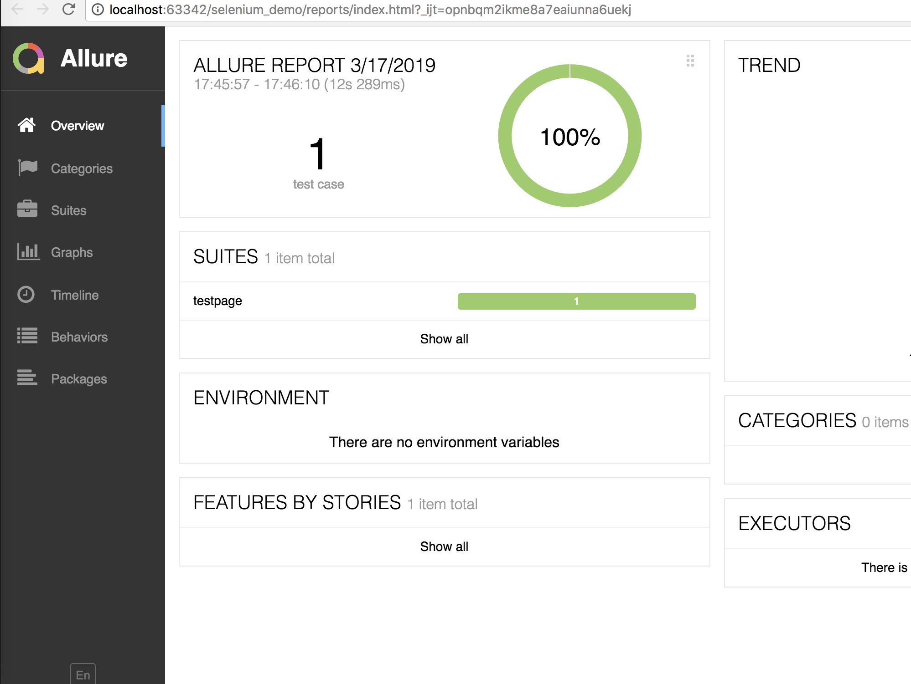
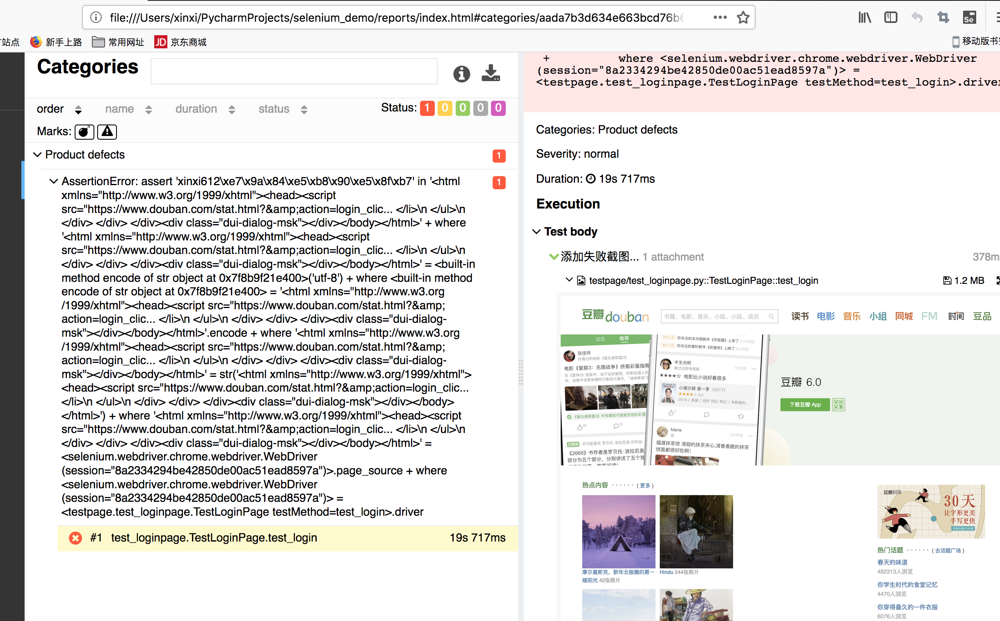

# 简介

python selenium自动化测试,基于PO封装代码<br>
使用allure生成测试报告,支持失败截图<br>

# 执行命令
```angularjs
python run.py
```

# 调试命令

pytest -q -v  -s testpage/test_bookpage.py

# 报告

<br>
<br>



# selenium grid分布式
基于docker做兼容性测试

## 启动hub
java -jar selenium-server-standalone-3.141.59.jar -role hub -port 4455

## 启动node
java -jar selenium-server-standalone-3.141.59.jar -role node  -hub http://localhost:4444/grid/register

## 查看log日志
http://localhost:4444/grid/console

# jenkins集成
持续触发、持续构建

# 学习贴

ChromeOptions设置<br>
https://peter.sh/experiments/chromium-command-line-switches/

pytest参数化测试是否适用于基于单元测试类的测试？<br>
https://stackoverflow.com/questions/18182251/does-pytest-parametrized-test-work-with-unittest-class-based-tests


python的unittest单元测试框架改装传参<br>
https://blog.csdn.net/hqzxsc2006/article/details/50125735
